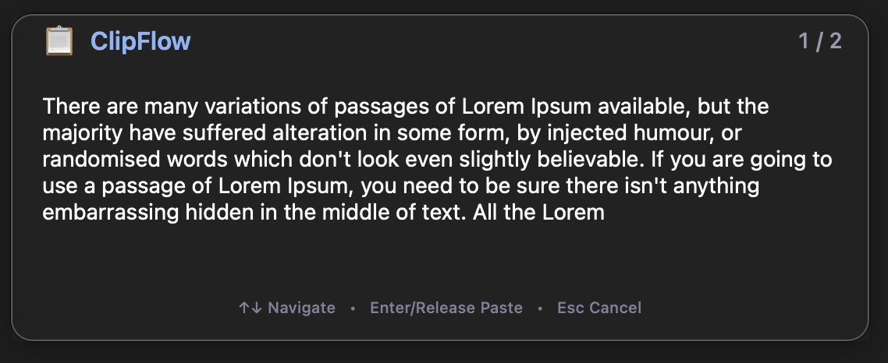
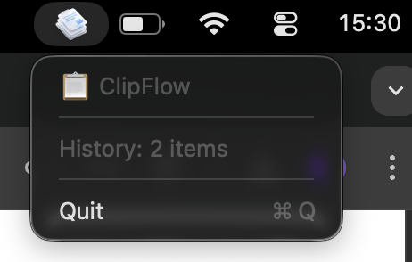

# ClipFlow 📋

**The clipboard history manager that macOS should have built-in**

Windows users have `Win + V` for clipboard history since 2018. Mac users? Nothing built-in. **ClipFlow fixes that for Mac.**

> 💡 **Note:** This app is primarily for **macOS users**. Windows users already have `Win + V` built-in!


## 📸 Screenshots

| Popup UI | Menu Bar |
|----------|----------|
|  |  |

---

## 📥 Installation

### Option 1: Download DMG (Easiest)
1. Download `ClipFlow-1.0.0.dmg` from [Releases](../../releases)
2. Open the DMG and drag `ClipFlow.app` to Applications
3. Open ClipFlow and grant Accessibility permissions

### Option 2: Homebrew
```bash
brew tap praneeth552/clipflow
brew install --cask clipflow
```

### Option 3: Build from Source
```bash
git clone https://github.com/praneeth552/clipflow.git
cd clipflow/ClipFlowApp
./build.sh
```

---

## ⚠️ First Launch (Important!)

Since ClipFlow is not notarized (requires $99/year Apple Developer account), macOS will show a warning:

> "ClipFlow can't be opened because it is from an unidentified developer"

**To bypass this (one-time only):**

1. **Right-click** on ClipFlow.app → **Open**
2. Click **Open** in the dialog

**Or via System Settings:**
1. Open **System Settings** → **Privacy & Security**
2. Scroll down and click **Open Anyway** next to ClipFlow

---

## 🔐 Grant Accessibility Permissions

ClipFlow needs Accessibility access for global hotkeys:

1. **System Settings** → **Privacy & Security** → **Accessibility**
2. Click **+** and add `ClipFlow.app`
3. Toggle **ON**

---

## ⌨️ Keyboard Shortcuts

| Shortcut | Action |
|----------|--------|
| `Cmd + Shift + V` | Open clipboard history |
| `↑` | Go to older item (like terminal) |
| `↓` | Go to newer item |
| `Enter` | Paste selected item |
| `Esc` | Cancel |
| Release `Cmd` | Paste selected item |

---

## ✨ Features

- 📋 **Clipboard History** - Saves last 50 copies (text + images)
- ⌨️ **Terminal-style Navigation** - Use ↑↓ like shell history
- 🖼️ **Image Previews** - See thumbnails in popup
- 🎯 **Cursor-following** - Popup appears at your mouse
- 🔄 **Dynamic Resize** - Smooth animations
- 🖥️ **Multi-Monitor** - Works across displays
- 🚫 **Non-focusable** - Doesn't interrupt typing

---

## 📦 Building

### Requirements
- macOS 12+
- Xcode Command Line Tools (`xcode-select --install`)

### Build Commands
```bash
cd ClipFlowApp

# Quick compile (development)
swiftc -o ClipFlow ClipFlowApp.swift -framework AppKit -framework Carbon

# Full build with .app bundle and DMG
./build.sh
```

### Output
```
build/
├── ClipFlow.app      # Application bundle
└── ClipFlow-1.0.0.dmg # Installer for distribution
```

---

## 🔐 Privacy & Security

**ClipFlow is 100% transparent and trustworthy:**

| Privacy Feature | Status |
|-----------------|--------|
| Open Source | ✅ All code visible on GitHub |
| Network Access | ✅ Zero internet connections, ever |
| Analytics | ✅ No tracking, no telemetry |
| Data Storage | ✅ Local only - never leaves your Mac |
| Persistence | ✅ History clears when app quits |

### Why the "unidentified developer" warning?

Apple's notarization requires a $99/year Developer account. ClipFlow is **free and open source**, so we don't pay this fee.

**The warning does NOT mean the app is dangerous.** You can:
- 📖 **Verify the code** yourself - it's all on GitHub
- 🔨 **Build from source** if you prefer: `./build.sh`
- ✅ **Right-click → Open** to bypass the warning (one-time)

> 💡 Many popular open source Mac apps (like Rectangle, MonitorControl, etc.) 
> also show this warning. It's normal for indie/open source software!

---

## 🗺️ Roadmap

- [ ] Persistent history (survives restarts)
- [ ] Configurable max history size
- [ ] Keyboard shortcut customization
- [ ] Search through history
- [ ] Pin favorite items

---

## 📄 License

MIT License - Use, modify, and distribute freely!

---

**Made with ❤️ for Mac users who deserve proper clipboard history**
